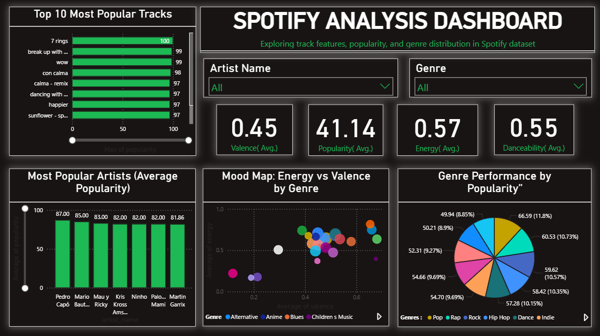
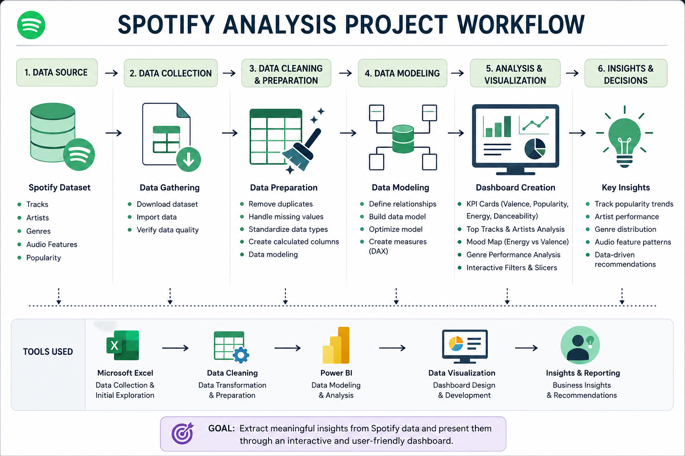

# 🎵 Spotify Music Analysis Dashboard

### Exploring Track Features, Popularity, and Genre Trends Through Data Analytics




---

## 📖 Project Overview

The Spotify Music Analysis Dashboard is an interactive Power BI project designed to analyze music data and uncover trends in track popularity, artist performance, genre distribution, and audio characteristics.

The dashboard transforms raw Spotify data into meaningful visual insights that help understand listener preferences and music patterns across different genres and artists.

---

## 🎯 Project Objectives

- Analyze track popularity across artists and genres
- Identify top-performing artists
- Compare genre popularity and distribution
- Study music characteristics such as energy, valence, and danceability
- Build interactive visualizations for music analytics
- Generate insights into listener preferences and music trends

---

## 🛠️ Tools & Technologies Used

- Power BI
- Microsoft Excel
- Data Cleaning & Transformation
- Data Visualization
- KPI Analytics
- Business Intelligence

---

## 📊 Dashboard Features

- Top 10 Most Popular Tracks
- Artist Popularity Analysis
- Genre Performance Analysis
- Energy vs Valence Mood Map
- Interactive Genre Filtering
- Artist-Based Analysis
- KPI Monitoring Dashboard
- Music Feature Comparison

---

## 📈 Key KPIs

- Average Popularity
- Average Energy
- Average Danceability
- Average Valence
- Top Performing Artists
- Top Popular Tracks
- Genre Performance Metrics

---

## 🔄 Workflow Diagram



---

## 💡 Key Insights

- Popular songs generally have higher energy and danceability scores.
- Certain artists consistently achieve higher average popularity.
- Different genres display unique emotional and energy characteristics.
- Music popularity varies significantly across genres.
- Audio features such as valence and energy can influence listener engagement.
- Genre analysis helps identify trends in audience preferences.

---

## 🖼️ Dashboard Preview

### Spotify Music Analysis Dashboard


---

## 📂 Dataset Information

The dataset contains Spotify track information including:

- Track Name
- Artist Name
- Genre
- Popularity Score
- Danceability
- Energy
- Valence
- Tempo
- Acousticness
- Instrumentalness
- Liveness
- Speechiness

The data is used to analyze music trends, artist performance, and listener preferences.

---

## 📂 Repository Structure

```text
spotify-music-analysis/
│
├── dataset/
│   └── spotify_dataset.csv
│
├── dashboard/
│   └── Spotify_Music_Analysis.pbix
│
├── images/
│   ├── spotify-dashboard.png
│   └── workflow-diagram.png
│
├── documentation/
│   ├── Dashboard_Explanation.docx
│   ├── Dataset_Information.md
│   └── Project_Summary.md
│
├── README.md
└── LICENSE
```

---

## 📚 Documentation

The repository includes:

- Dashboard Explanation
- Dataset Information
- Project Summary

---

## 🚀 Future Enhancements

- Music Recommendation System
- Sentiment Analysis on Song Lyrics
- Spotify API Integration
- Artist Popularity Forecasting
- Advanced Genre Clustering
- Real-Time Music Trend Analysis

---

## 🌟 Conclusion

The Spotify Music Analysis Dashboard demonstrates how Power BI can be used to transform music data into actionable insights. By analyzing track popularity, artist performance, genre trends, and audio features, the dashboard provides a comprehensive view of music consumption patterns and listener preferences.

This project highlights the power of data analytics and visualization in understanding trends within the music industry.

---

## 👩‍💻 Author

**Janhvi Mishra**

Aspiring Data Analyst passionate about Data Analytics, Business Intelligence, Data Visualization, and Data-Driven Decision Making.

### Connect With Me

- LinkedIn: https://linkedin.com/in/janhvi-mishra-4ab72328a
- GitHub: https://github.com/janhvi-mishra-data

